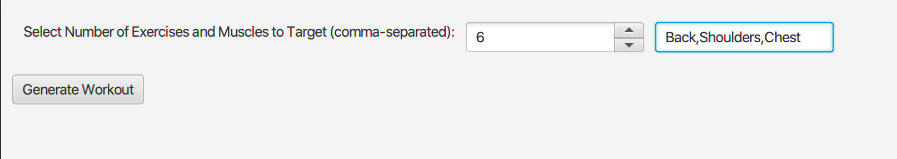
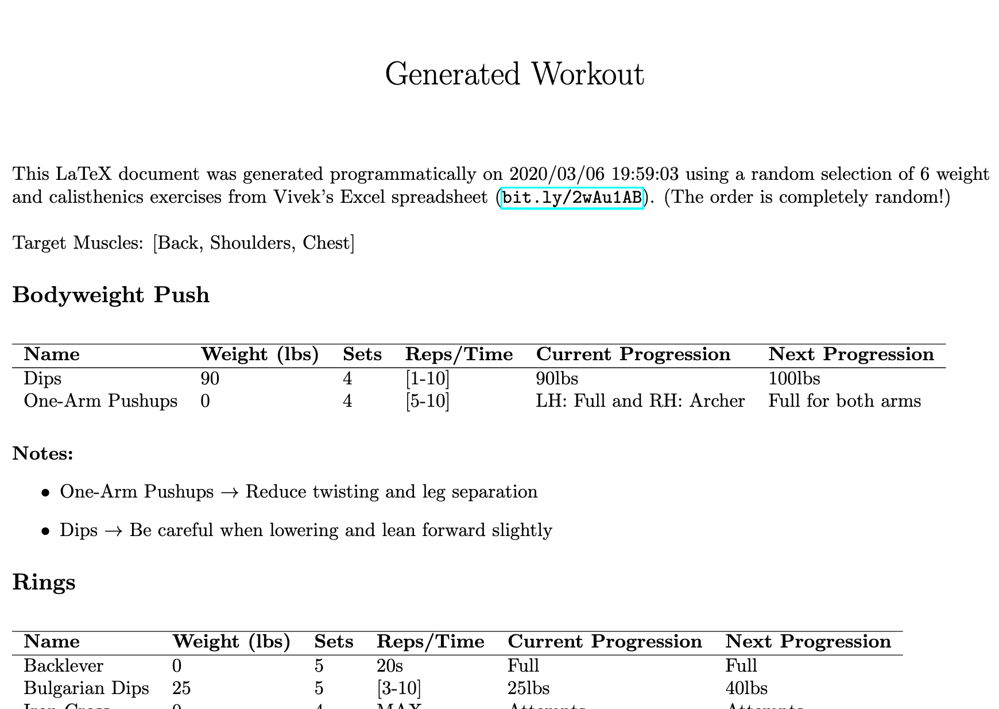

# workout-generator
A JavaFX program that parses an Excel spreadsheet (csv) containing different weight/calisthenics exercises and current progression/weight/notes for each. This data is used to randomly generate a workout routine (with the number of exercises and target muscles chosen by the user). Each exercise is catgorized and displayed in a LaTeX document (compiled using latexonline.cc)

## Example

